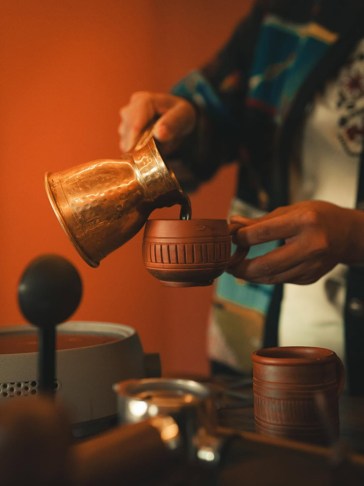
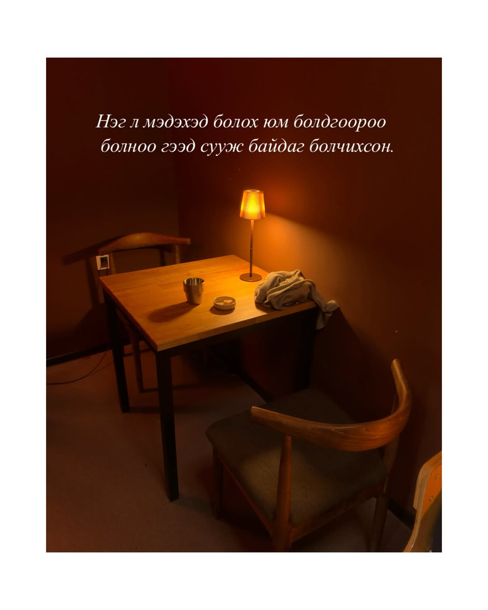
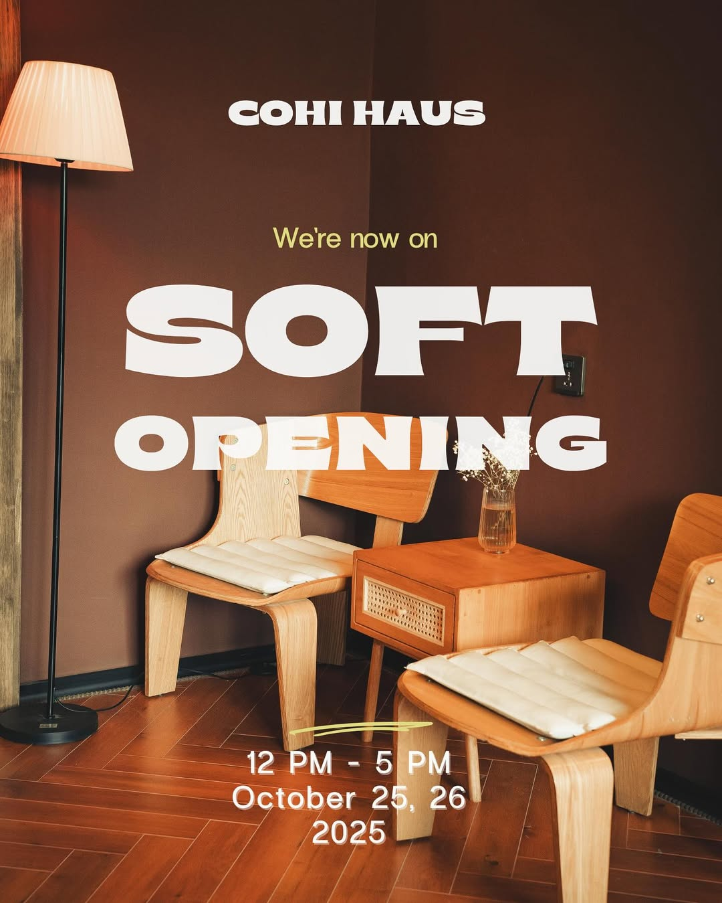
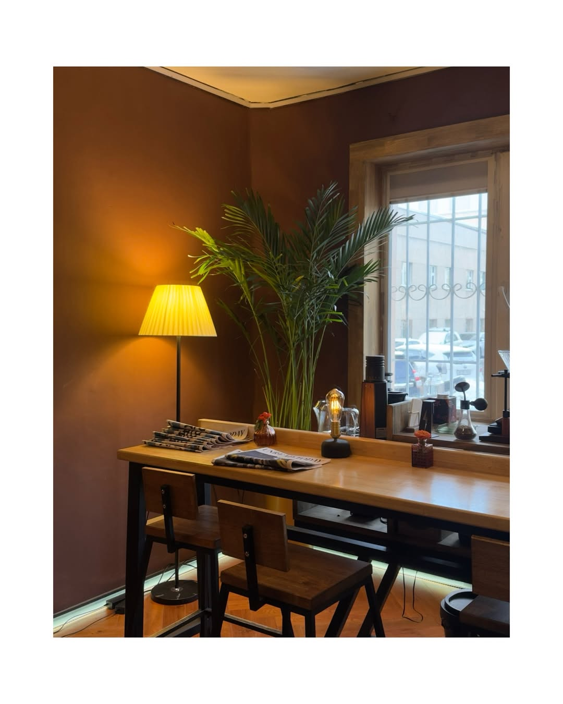
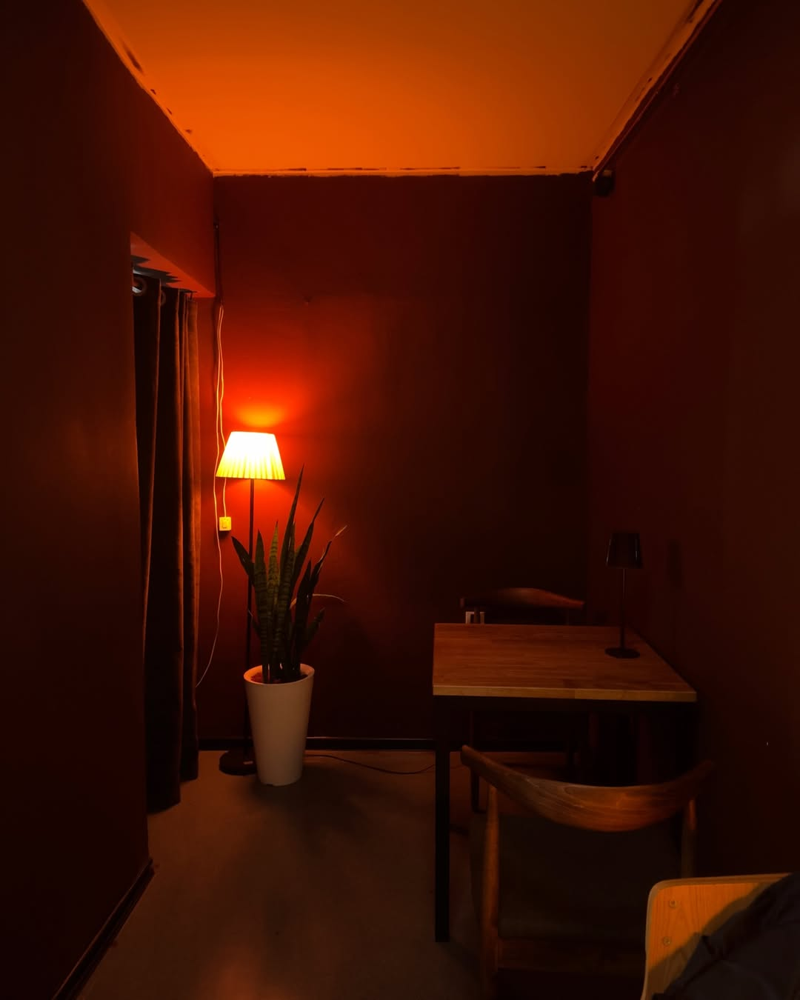

<!DOCTYPE html>
<html lang="mn">
<head>
    <meta charset="UTF-8">
    <meta name="viewport" content="width=device-width, initial-scale=1.0">
    <title>CŌHI HAUS — Гар Урлалын Кофе</title>

    <link rel="preconnect" href="https://fonts.googleapis.com">
    <link rel="preconnect" href="https://fonts.gstatic.com" crossorigin>
    <link href="https://fonts.googleapis.com/css2?family=Archivo+Black&family=Playfair+Display:ital@1&family=Space+Grotesk:wght@400;500;700&family=JetBrains+Mono:wght@400;500&display=swap" rel="stylesheet">

    
</head>
<body>

    

    

    

    <header>
        
Cōhi Haus

        <nav class="primary-nav">
            <a href="#opening">Soft Opening</a>
            <a href="#process">Цэс</a>
            <a href="#gallery">Дотроос нь</a>
            <a href="#visit">Хаяг</a>
        </nav>
        
📍 Циркийн баруун талд

    </header>

    

        <section class="section section-1">
            
// Handcrafted Coffee — Ulaanbaatar

            <h1 class="brand-mark">ГАР УРЛАЛЫН КОФЕНЫ УРСГАЛ</h1>
            
"We invite you to experience our first brew, crafted by hand and shared with heart."

            
Доош гүйлгэнэ үү

        </section>

        <section class="section section-2">
            

                <figure class="pair-photo">
                    
                    <figcaption>Turkish Sand Coffee</figcaption>
                </figure>
                

                    <h2>Хамгийн Эртний Арга</h2>
                    
Халуун элсэн дээр гуулин саванд аажмаар боргилуулсан, хамгийн эртний Туркийн уламжлалт кофег Япон баристагийн нарийн мэдрэмжээр бэлдэнэ. Шилэн S-хоолой болон мушгиа спиралиар уруудах дусал бүр өтгөн, хөөстэй.

                

            

        </section>

        <section class="section section-3">
            

                <figure class="pair-photo">
                    
                    <figcaption>Quiet Corner</figcaption>
                </figure>
                

                    <h2 class="brand-mark">НЭГ УРСГАЛ. НЭГ ШИЛ. ТАЙВАН ОРЧИН.</h2>
                    <a href="#visit" class="call-btn">Хаяг харах →</a>
                

            

        </section>
    

    <main class="body-content">

        <section class="opening-band" id="opening">
            

                

                    
                    

                        
// We're Now Open

                        <h2 class="brand-mark">Soft Opening</h2>
                        
10-р сарын 25, 26 — 12:00 - 17:00

                        
Анхны хандлагаа гараараа бэлдэж, сэтгэлээсээ үйлчилнэ. Эхний хоёр өдрийн зочдоо тайван, дулаахан орчинд хүлээж байна.

                    

                

            

        </section>

        <section class="process" id="process">
            

                

                    

                        
// Science Meets Coffee

                        <h2>Хандлалтын Төрлүүд</h2>
                    

                    
03 АРГА БАРИЛ

                

                

                    

                        01
                        <h3>Pour Over</h3>
                        
Цаасан шүүлтүүрээр дусаж, шилэн S-хоолой болон спиралиар уруудах маш тунгалаг, цэвэр хандлалт. Жимсний болон цэцгийн нарийн амтыг дээд цэгт нь мэдрүүлнэ.

                    

                    

                        02
                        <h3>Syphon Coffee</h3>
                        
Вакуум даралтаар нэрдэг, шинжлэх ухаан ба урлагийн төгс хослол. Биет нь арай хүнд бөгөөд кофены гүн баялаг амтыг хадгална.

                    

                    

                        03
                        <h3>Turkish Sand Coffee</h3>
                        
Хамгийн эртний уламжлалт арга — халуун элсэн дээр гуулин саванд аажмаар боргилуулан чанадаг өтгөн, хөөстэй кофе.

                    

                

            

        </section>

        <section class="gallery" id="gallery">
            

                

                    

                        
// Inside The Haus

                        <h2>Дотроос Нь</h2>
                    

                    
ДАРЖ ВИДЕО ҮЗНЭ ҮҮ

                

                

                    

                        <video muted loop playsinline preload="none" poster="assets/poster-syphon.jpg"></video>
                        
<svg viewBox="0 0 24 24" fill="white"><circle cx="12" cy="12" r="11" fill="rgba(13,13,13,0.55)"/><path d="M9.5 7.5l8 4.5-8 4.5z"/></svg>

                        Art of Syphon
                    

                    

                        
                        Window Bar
                    

                    

                        <video muted loop playsinline preload="none" poster="assets/poster-turkish.jpg"></video>
                        
<svg viewBox="0 0 24 24" fill="white"><circle cx="12" cy="12" r="11" fill="rgba(13,13,13,0.55)"/><path d="M9.5 7.5l8 4.5-8 4.5z"/></svg>

                        Turkish Coffee
                    

                    

                        
                        Corner Light
                    

                    

                        <video muted loop playsinline preload="none" poster="assets/poster-best.jpg"></video>
                        
<svg viewBox="0 0 24 24" fill="white"><circle cx="12" cy="12" r="11" fill="rgba(13,13,13,0.55)"/><path d="M9.5 7.5l8 4.5-8 4.5z"/></svg>

                        Cōhi Haus Reel
                    

                

            

        </section>

        <footer id="visit">
            

                

                    

                        
Cōhi Haus

                        
handcrafted coffee

                        
Pour over, syphon, Turkish sand coffee. Гар урлалын кофе, Улаанбаатарт.

                    

                    

                        <h4>Байршил & Цаг</h4>
                        <ul>
                            <li><address>📍 Циркийн баруун талд, Улаанбаатар</address></li>
                            <li style="color: var(--amber);">Soft Opening: 10-р сарын 25–26, 12:00–17:00</li>
                        </ul>
                    

                    

                        <h4>Холбоо Барих</h4>
                        <ul>
                            <li><a href="#">Instagram — @cohihaus</a></li>
                            <li style="color: var(--ink-dim); font-size: 0.85rem;">Утас / и-мэйл — захиалагчаас баталгаажуулна уу</li>
                        </ul>
                    

                

                

                    © 2026 CŌHI HAUS
                    handcrafted coffee //
                

            

        </footer>
    </main>

    
    

    
</body>
</html>
